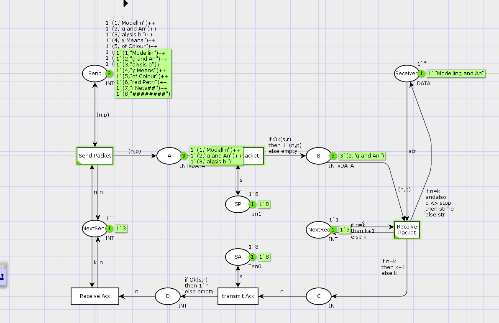
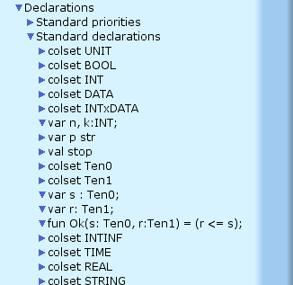
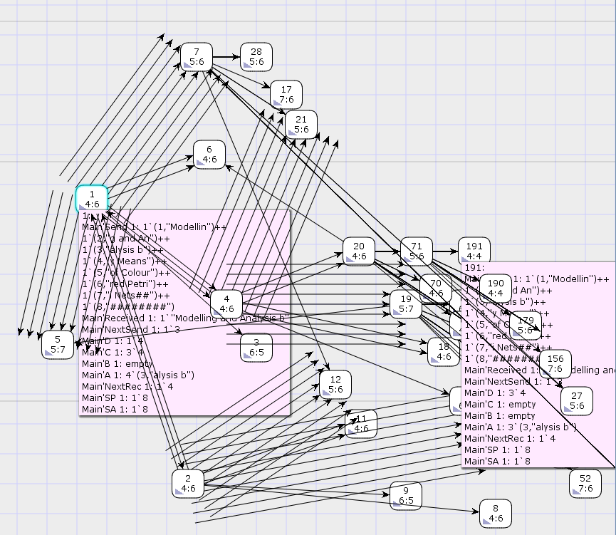

---
## Front matter
lang: ru-RU
title: Лабораторная работа №12
subtitle: Пример моделирования простого протокола передачи данных
author:
  - Хватов М.Г.
institute:
  - Российский университет дружбы народов, Москва, Россия

## i18n babel
babel-lang: russian
babel-otherlangs: english

## Formatting pdf
toc: false
toc-title: Содержание
slide_level: 2
aspectratio: 169
section-titles: true
theme: metropolis
header-includes:
 - \metroset{progressbar=frametitle,sectionpage=progressbar,numbering=fraction}
 - '\makeatletter'
 - '\beamer@ignorenonframefalse'
 - '\makeatother'
---

# Информация

## Докладчик

:::::::::::::: {.columns align=center}
::: {.column width="60%"}

  * Хватов Максим Григорьевич
  * студент
  * Российский университет дружбы народов
  * [1032204364@pfur.ru](mailto:1032204364@pfur.ru)

:::
::: {.column width="25%"}


:::
::::::::::::::

## Цели и задачи

**Цель работы**

Реализовать простой протокол передачи данных в CPN Tools.

**Задание**

- Реализовать простой протокол передачи данных в CPN Tools.
- Вычислить пространство состояний, сформировать отчет о нем и построить граф.

## Выполнение лабораторной работы

{#fig:001 width=50%}

## Выполнение лабораторной работы

{#fig:002 width=60%}

## Выполнение лабораторной работы

{#fig:003 width=50%}

## Выполнение лабораторной работы

```
 Statistics
------------------------------------------------------------------------

  State Space
     Nodes:  28810
     Arcs:   551914
     Secs:   300
     Status: Partial

  Scc Graph
     Nodes:  15981
     Arcs:   485697
     Secs:   6
```

## Выполнение лабораторной работы

```
Best Integer Bounds
                             Upper      Lower
     Main'A 1                17         0
     Main'B 1                8          0
     Main'C 1                8          0
     Main'D 1                7          0
     Main'NextRec 1          1          1
     Main'NextSend 1         1          1
     Main'Received 1         1          1
     Main'SA 1               1          1
     Main'SP 1               1          1
     Main'Send 1             8          8
```
## Выполнение лабораторной работы

```
Liveness Properties
------------------------------------------------------------------------

  Dead Markings
     11039 [28810,28809,28808,28807,28806,...]

  Dead Transition Instances
     None

  Live Transition Instances
     None
```

## Выполнение лабораторной работы

Fairness Properties
------------------------------------------------------------------------

  Impartial Transition Instances
     Main'Send_Packet 1
     Main'Transmit_packet 1

  Fair Transition Instances
     None

  Just Transition Instances
     None

  Transition Instances with No Fairness
     Main'Receive_Ack 1
     Main'Receive_Packet 1
     Main'transmit_Ack 1

## Выводы из отчета упражнения

- Пространство состояний **неполное** -> результаты анализа ограничены.
- Есть **мертвые состояния**, но нет мертвых/живых переходов — модель, вероятно, зацикливается или завершается.
- **Ограниченность** соблюдается: все места имеют разумные границы.
- В модели **нет home-состояний** — это может говорить о неустойчивости или незавершенности системы.

## Выводы

В процессе выполнения данной лабораторной работы я реализовал простой протокол передачи данных в CPN Tools и проведен анализ его пространства состояний.
