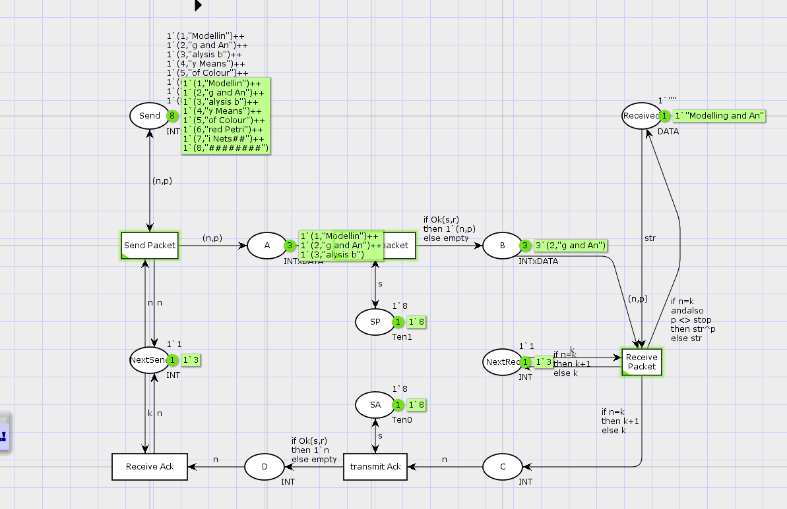
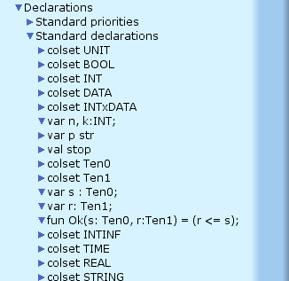
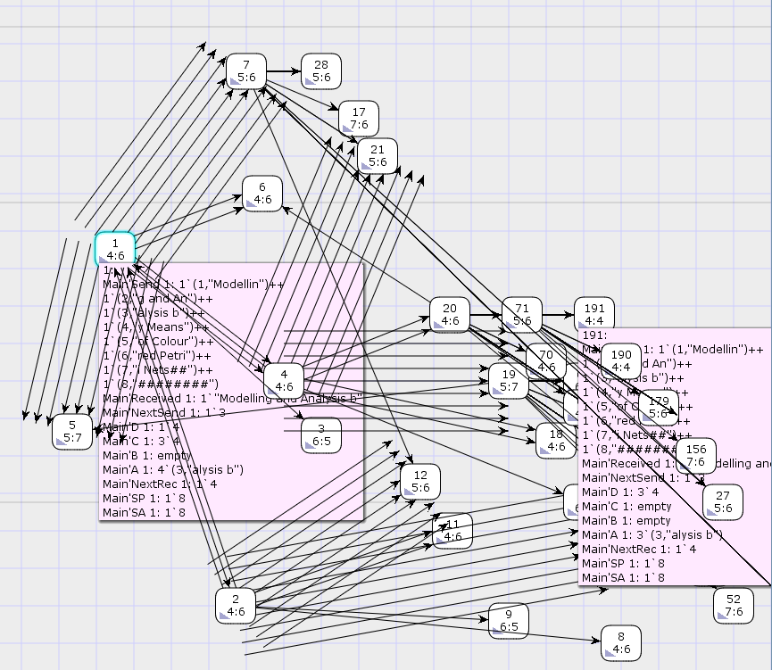

---
## Front matter
title: "Лабораторная работа №12"
subtitle: "Пример моделирования простого протокола передачи данных"
author: "Хватов М. Г."

## Generic otions
lang: ru-RU
toc-title: "Содержание"

## Bibliography
bibliography: bib/cite.bib
csl: pandoc/csl/gost-r-7-0-5-2008-numeric.csl

## Pdf output format
toc: true # Table of contents
toc-depth: 2
lof: true # List of figures
lot: false # List of tables
fontsize: 12pt
linestretch: 1.5
papersize: a4
documentclass: scrreprt
## I18n polyglossia
polyglossia-lang:
  name: russian
  options:
	- spelling=modern
	- babelshorthands=true
polyglossia-otherlangs:
  name: english
## I18n babel
babel-lang: russian
babel-otherlangs: english
## Fonts
mainfont: PT Serif
romanfont: PT Serif
sansfont: PT Sans
monofont: PT Mono
mainfontoptions: Ligatures=TeX
romanfontoptions: Ligatures=TeX
sansfontoptions: Ligatures=TeX,Scale=MatchLowercase
monofontoptions: Scale=MatchLowercase,Scale=0.9
## Biblatex
biblatex: true
biblio-style: "gost-numeric"
biblatexoptions:
  - parentracker=true
  - backend=biber
  - hyperref=auto
  - language=auto
  - autolang=other*
  - citestyle=gost-numeric
## Pandoc-crossref LaTeX customization
figureTitle: "Рис."
tableTitle: "Таблица"
listingTitle: "Листинг"
lofTitle: "Список иллюстраций"
lotTitle: "Список таблиц"
lolTitle: "Листинги"
## Misc options
indent: true
header-includes:
  - \usepackage{indentfirst}
  - \usepackage{float} # keep figures where there are in the text
  - \floatplacement{figure}{H} # keep figures where there are in the text
---

# Цель работы

Реализовать простой протокол передачи данных в CPN Tools.

# Задание

- Реализовать простой протокол передачи данных в CPN Tools.
- Вычислить пространство состояний, сформировать отчет о нем и построить граф.

# Выполнение лабораторной работы

Основные состояния: источник (Send), получатель (Receiver).
Действия (переходы): отправить пакет (Send Packet), отправить подтверждение (Send ACK).
Промежуточное состояние: следующий посылаемый пакет (NextSend).
Построил начальный граф и задал декларации моделей (рис. [-@fig:001]).

{#fig:001 width=70%}

Состояние Send имеет тип INTxDATA и следующую начальную маркировку (в соответствии с передаваемой фразой).

Стоповый байт ("########") определяет, что сообщение закончилось. Состояние Receiver имеет тип DATA и начальное значение 1'"" (т.е. пустая строка, поскольку состояние собирает данные и номер пакета его не интересует). Состояние NextSend имеет тип INT и начальное значение 1'1. Поскольку пакеты представляют собой кортеж, состоящий из номера пакета и строки, то выражение у двусторонней дуги будет иметь значение (n,p). Кроме того, необходимо взаимодействовать с состоянием, которое будет сообщать номер следующего посылаемого пакета данных. Поэтому переход Send Packet соединяем с состоянием NextSend двумя дугами с выражениями n (рис. 12.1). Также необходимо получать информацию с подтверждениями о получении данных. От перехода Send Packet к состоянию NextSend дуга с выражением n, обратно -- k.

{#fig:003 width=70%}

Зададим промежуточные состояния (A, B с типом INTxDATA, C, D с типом INTxDATA) для переходов (рис. 12.2): передать пакет Transmit Packet (передаём (n,p)), передать подтверждение Transmit ACK (передаём целое число k). Добавляем переход получения пакета (Receive Packet). От состояния Receiver идёт дуга к переходу Receive Packet со значением той строки (str), которая находится в состоянии Receiver. Обратно: проверяем, что номер пакета новый и строка не равна стоп-биту. Если это так, то строку добавляем к полученным данным. Кроме того, необходимо знать, каким будет номер следующего пакета. Для этого добавляем состояние NextRec с типом INT и начальным значением 1'1 (один пакет), связываем его дугами с переходом Receive Packet. Причём к переходу идёт дуга с выражением k, от перехода — if n=k then k+1 else k. Связываем состояния B и C с переходом Receive Packet. От состояния B к переходу Receive Packet — выражение (n,p), от перехода Receive Packet к состоянию C — выражение if n=k then k+1 else k. От перехода Receive Packet к состоянию Receiver: if n=k andalso p<>stop then str^p else str. (если n=k и мы не получили стоп-байт, то направляем в состояние строку и к ней прикрепляем p, в противном случае посылаем только строку).  На переходах Transmit Packet и Transmit ACK зададим потерю пакетов. Для этого на интервале от 0 до 10 зададим пороговое значение и, если передаваемое значение превысит этот порог, то считаем, что произошла потеря пакета, если нет, то передаём пакет дальше. Для этого задаём вспомогательные состояния SP и SA с типом Ten0 и начальным значением 1`8, соединяем с соответствующими переходами.

Таким образом, получим модель простого протокола передачи данных (рис. 12.3).
Пакет последовательно проходит: состояние Send, переход Send Packet, состояние A, с некоторой вероятностью переход Transmit Packet, состояние B, попадает
на переход Receive Packet, где проверяется номер пакета и если нет совпадения,
то пакет направляется в состояние Received, а номер пакета передаётся последовательно в состояние C, с некоторой вероятностью в переход Transmit ACK,
далее в состояние D, переход Receive ACK, состояние NextSend (увеличивая на 1
номер следующего пакета), переход Send Packet. Так продолжается до тех пор,
пока не будут переданы все части сообщения. Последней будет передана стоп-последовательность

## Упражнение

**Модель:** `<unsaved net>`  
**Дата генерации:** 25 апреля 2025, 11:39:37

---

## Статистика

### State Space
- **Узлы (Nodes):** 28,810
- **Дуги (Arcs):** 551,914
- **Время построения:** 300 секунд
- **Статус:** `Partial` (неполное построение — достигнут лимит времени)

### SCC Graph (сильно связные компоненты)
- **Узлы:** 15,981
- **Дуги:** 485,697
- **Время:** 6 секунд

---

## Свойства ограниченности (Boundedness)

### Целочисленные границы (Best Integer Bounds)

| Место                | Верхняя граница | Нижняя граница |
|----------------------|------------------|------------------|
| Main'A 1             | 17               | 0                |
| Main'B 1             | 8                | 0                |
| Main'C 1             | 8                | 0                |
| Main'D 1             | 7                | 0                |
| Main'NextRec 1       | 1                | 1                |
| Main'NextSend 1      | 1                | 1                |
| Main'Received 1      | 1                | 1                |
| Main'SA 1            | 1                | 1                |
| Main'SP 1            | 1                | 1                |
| Main'Send 1          | 8                | 8                |

### Верхние мульти-множества (Best Upper Multi-set Bounds)

- **Main'A 1:**  
  `17` × (3,"alysis b") ++  
  `12` × (4,"y Means") ++  
  `6` × (5,"of Colour") ++  
  `1` × (6,"red Petri")

- **Main'B 1:**  
  `8` × (3,"alysis b") ++  
  `6` × (4,"y Means") ++  
  `3` × (5,"of Colour")

- **Main'C 1:** `8`×4 ++ `5`×5 ++ `2`×6  
- **Main'D 1:** `7`×4 ++ `3`×5 ++ `1`×6  

- **Main'NextRec 1:** `1`×4 ++ `1`×5 ++ `1`×6  
- **Main'NextSend 1:** `1`×3 ++ `1`×4 ++ `1`×5 ++ `1`×6  
- **Main'Received 1:**  
  - 1 × `"Modelling and Analysis b"`  
  - 1 × `"Modelling and Analysis by Means"`  
  - 1 × `"Modelling and Analysis by Meansof Colour"`

- **Main'SA 1:** `1`×8  
- **Main'SP 1:** `1`×8  
- **Main'Send 1:**  
  - 1`(1,"Modellin")  
  - 1`(2,"g and An")  
  - 1`(3,"alysis b")  
  - 1`(4,"y Means")  
  - 1`(5,"of Colour")  
  - 1`(6,"red Petri")  
  - 1`(7,"i Nets##")  
  - 1`(8,"########")

### Нижние мульти-множества (Best Lower Multi-set Bounds)

- **Main'A 1 — Main'Received 1:** `empty`  
- **Main'SA 1:** `1`×8  
- **Main'SP 1:** `1`×8  
- **Main'Send 1:** как и верхняя граница — те же 8 строк текста

---

## Home-свойства

- **Home Markings:** `Нет`

---

## Liveness (живость)

- **Мертвые маркировки (Dead markings):** 11,039  
  _(например: 28810, 28809, 28808, …)_

- **Мертвые переходы (Dead transition instances):** `None`  
- **Живые переходы (Live transition instances):** `None`

---

## Fairness (Справедливость переходов)

- **Impartial (Несправедливые, но доступные):**
  - `Main'Send_Packet 1`
  - `Main'Transmit_packet 1`

- **Fair (Справедливые):** `None`  
- **Just (Справедливые по справедливости Джастиса):** `None`  
- **Без свойств справедливости (No Fairness):**
  - `Main'Receive_Ack 1`
  - `Main'Receive_Packet 1`
  - `Main'transmit_Ack 1`

---

## Выводы

- Пространство состояний **неполное** → результаты анализа ограничены.
- Есть **мертвые состояния**, но нет мертвых/живых переходов — модель, вероятно, зацикливается или завершается.
- **Ограниченность** соблюдается: все места имеют разумные границы.
- В модели **нет home-состояний** — это может говорить о неустойчивости или незавершенности системы.

Результирующий граф состояний модели:

{#fig:004 width=70%}

# Вывод

В процессе выполнения данной лабораторной работы я реализовал простой протокол передачи данных в CPN Tools и проведен анализ его пространства состояний.
