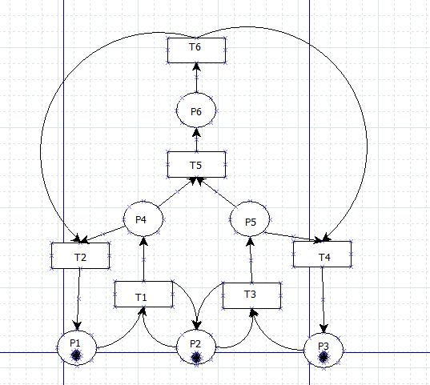
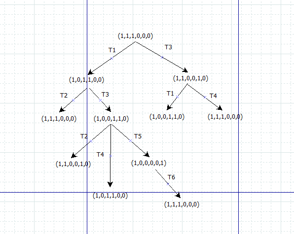
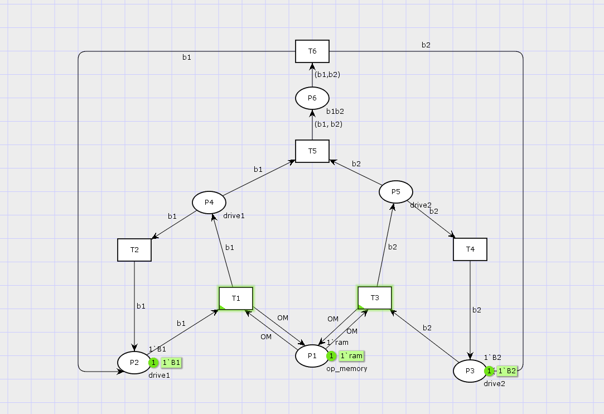
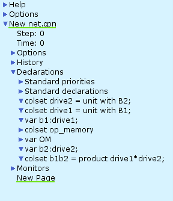
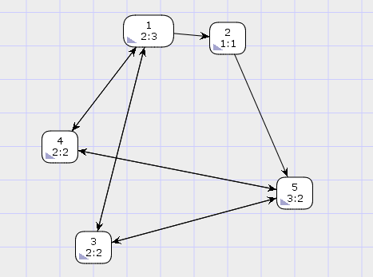

---
## Front matter
lang: ru-RU
title: Лабораторная работа №13
subtitle: Задание для самостоятельного выполнения
author:
  - Хватов М.Г.
institute:
  - Российский университет дружбы народов, Москва, Россия

## i18n babel
babel-lang: russian
babel-otherlangs: english

## Formatting pdf
toc: false
toc-title: Содержание
slide_level: 2
aspectratio: 169
section-titles: true
theme: metropolis
header-includes:
 - \metroset{progressbar=frametitle,sectionpage=progressbar,numbering=fraction}
 - '\makeatletter'
 - '\beamer@ignorenonframefalse'
 - '\makeatother'
---

# Информация

## Докладчик

:::::::::::::: {.columns align=center}
::: {.column width="60%"}

  * Хватов Максим Григорьевич
  * студент
  * Российский университет дружбы народов
  * [1032204364@pfur.ru](mailto:1032204364@pfur.ru)

:::
::: {.column width="25%"}


:::
::::::::::::::

## Постановка задачи

1. Используя теоретические методы анализа сетей Петри, провести анализ сети (с помощью построения дерева достижимости). Определить, является ли сеть безопасной, ограниченной, сохраняющей, имеются ли
тупики.
2. Промоделировать сеть Петри с помощью CPNTools.
3. Вычислить пространство состояний. Сформировать отчёт о пространстве состояний и проанализировать его.Построить граф пространства состояний.

## Выполнение лабораторной работы

{#fig:001 width=70%}

## Выполнение лабораторной работы

{#fig:002 width=70%}

## Выполнение лабораторной работы

{#fig:003 width=70%}

## Выполнение лабораторной работы

{#fig:004 width=70%}

## Выполнение лабораторной работы

{#fig:005 width=70%}

```
 Statistics
------------------------------------------------------------------------

  State Space
     Nodes:  5
     Arcs:   10
     Secs:   0
     Status: Full

  Scc Graph
     Nodes:  1
     Arcs:   0
     Secs:   0
```

## Выполнение лабораторной работы

```
Best Integer Bounds
                             Upper      Lower
     New_Page'P1 1           1          1
     New_Page'P2 1           1          0
     New_Page'P3 1           1          0
     New_Page'P4 1           1          0
     New_Page'P5 1           1          0
     New_Page'P6 1           1          0
```
## Выполнение лабораторной работы

```
Best Upper Multi-set Bounds
     New_Page'P1 1       1`ram
     New_Page'P2 1       1`B1
     New_Page'P3 1       1`B2
     New_Page'P4 1       1`B1
     New_Page'P5 1       1`B2
     New_Page'P6 1       1`(B1,B2)
```

## Выполнение лабораторной работы

Best Lower Multi-set Bounds
     New_Page'P1 1       1`ram
     New_Page'P2 1       empty
     New_Page'P3 1       empty
     New_Page'P4 1       empty
     New_Page'P5 1       empty
     New_Page'P6 1       empty

## Выводы

Сеть Петри, 1-дезопасна (ограничена по одному маркеру в местах), живая(все переходы могут быть выполнены), обратима (любое состояние достижимо из любого другого), сильно связана.
Отстствуют тупиковые состояния и мертвые переходы, однако только преход Т6 является справедливым, Т5 - обоснованный, а остальные не обладают свойствами справедлиовсти, что может повлиять на их регулярное исполнение без внешнего управления.
