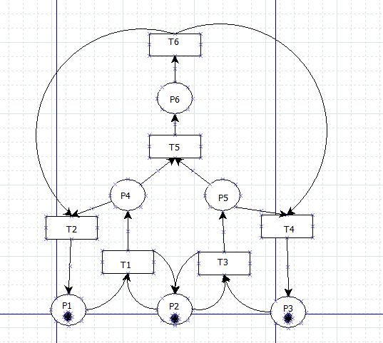
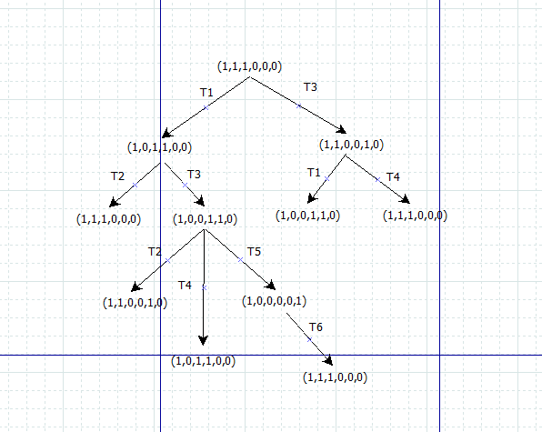
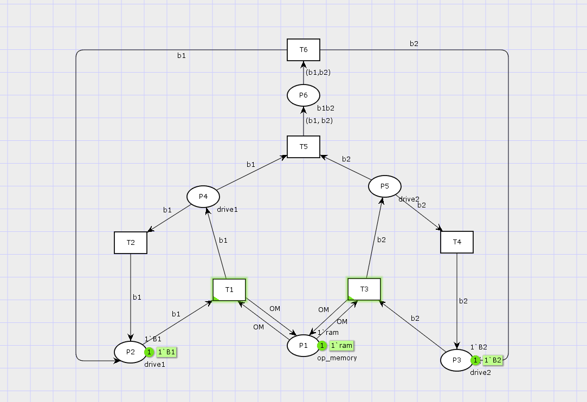
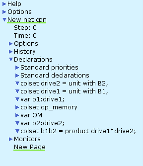
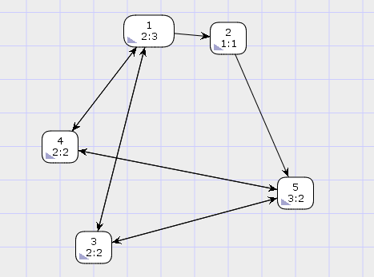

---
## Front matter
title: "Лабораторная работа №13"
subtitle: "Задание для самостоятельного выполнения"
author: "Хватов М. Г."

## Generic otions
lang: ru-RU
toc-title: "Содержание"

## Bibliography
bibliography: bib/cite.bib
csl: pandoc/csl/gost-r-7-0-5-2008-numeric.csl

## Pdf output format
toc: true # Table of contents
toc-depth: 2
lof: true # List of figures
lot: false # List of tables
fontsize: 12pt
linestretch: 1.5
papersize: a4
documentclass: scrreprt
## I18n polyglossia
polyglossia-lang:
  name: russian
  options:
	- spelling=modern
	- babelshorthands=true
polyglossia-otherlangs:
  name: english
## I18n babel
babel-lang: russian
babel-otherlangs: english
## Fonts
mainfont: PT Serif
romanfont: PT Serif
sansfont: PT Sans
monofont: PT Mono
mainfontoptions: Ligatures=TeX
romanfontoptions: Ligatures=TeX
sansfontoptions: Ligatures=TeX,Scale=MatchLowercase
monofontoptions: Scale=MatchLowercase,Scale=0.9
## Biblatex
biblatex: true
biblio-style: "gost-numeric"
biblatexoptions:
  - parentracker=true
  - backend=biber
  - hyperref=auto
  - language=auto
  - autolang=other*
  - citestyle=gost-numeric
## Pandoc-crossref LaTeX customization
figureTitle: "Рис."
tableTitle: "Таблица"
listingTitle: "Листинг"
lofTitle: "Список иллюстраций"
lotTitle: "Список таблиц"
lolTitle: "Листинги"
## Misc options
indent: true
header-includes:
  - \usepackage{indentfirst}
  - \usepackage{float} # keep figures where there are in the text
  - \floatplacement{figure}{H} # keep figures where there are in the text
---

# Постановка задачи

1. Используя теоретические методы анализа сетей Петри, провести анализ сети (с помощью построения дерева достижимости). Определить, является ли сеть безопасной, ограниченной, сохраняющей, имеются ли
тупики.
2. Промоделировать сеть Петри с помощью CPNTools.
3. Вычислить пространство состояний. Сформировать отчёт о пространстве состояний и проанализировать его.Построить граф пространства состояний.

# Выполнение лабораторной работы

## Схема модели

Заявка (команды программы, операнды) поступает в оперативную память (ОП), затем
передается на прибор (центральный процессор, ЦП) для обработки. После этого
заявка может равновероятно обратиться к оперативной памяти или к одному из двух
внешних запоминающих устройств (B1 и B2). Прежде чем записать информацию на
внешний накопитель, необходимо вторично обратиться к центральному процессору,
определяющему состояние накопителя и выдающему необходимую управляющую
информацию. Накопители (B1 и B2) могут работать в 3-х режимах:

1) B1 — занят, B2 — свободен;
2) B2 — свободен, B1 — занят;
3) B1 — занят, B2 — занят.

Сеть Петри моделируемой системы представлена на рис. [-@fig:001].

Множество позиций:

P1 — состояние оперативной памяти (свободна / занята);

P2 — состояние внешнего запоминающего устройства B1 (свободно / занято);

P3 — состояние внешнего запоминающего устройства B2 (свободно / занято);

P4 — работа на ОП и B1 закончена;

P5 — работа на ОП и B2 закончена;

P6 — работа на ОП, B1 и B2 закончена;

Множество переходов:

T1 — ЦП работает только с RAM и B1;

T2 — обрабатываются данные из RAM и с B1 переходят на устройство вывода;

T3 — CPU работает только с RAM и B2;

T4 — обрабатываются данные из RAM и с B2 переходят на устройство вывода;

T5 — CPU работает только с RAM и с B1, B2;

T6 — обрабатываются данные из RAM, B1, B2 и переходят на устройство вывода.

Функционирование сети Петри можно расматривать как срабатывание переходов,
в ходе которого происходит перемещение маркеров по позициям:

- работа CPU с RAM и B1 отображается запуском перехода T1 (удаление маркеров
из P1, P2 и появление в P1, P4), что влечет за собой срабатывание перехода T2,
т.е. передачу данных с RAM и B1 на устройство вывода;
- работа CPU с RAM и B2 отображается запуском перехода T3 (удаление маркеров
из P1 и P3 и появление в P1 и P5), что влечет за собой срабатывание перехода T4,
т.е. передачу данных с RAM и B2 на устройство вывода;
- работа CPU с RAM, B1 и B2 отображается запуском перехода T5 (удаление
маркеров из P4 и P5 и появление в P6), далее срабатывание перехода T6, и данные
из RAM, B1 и B2 передаются на устройство вывода;
- состояние устройств восстанавливается при срабатывании: RAM — переходов
T1 или T2; B1 — переходов T2 или T6; B2 — переходов T4 или T6.

{#fig:001 width=70%}

## Анализ сети Петри

Построим дерево достижимости (рис. [-@fig:002]).

{#fig:002 width=70%}

Можем увидеть, что представленная сеть:

- безопасна, поскольку в каждой
позиции количество фишек не превышает 1;
- ограничена, так как существует такое целое k, что число
фишек в каждой позиции не может превысить k (в данном случае k=1);
- сеть не имеет тупиков;
- сеть не является сохраняющей, так как при переходах t5 и t6 количество фишек меняется.

## Реализация модели в CPN Tools

Реализуем описанную ранее модель в CPN Tools. С помощью контекстного меню создаем новую сеть, далее нам понадобятся 6 позиций и 6 блоков переходов, затем их нужно соединить, а также задать параметры и начальные значения. Получаем готовую модель (рис. [-@fig:003]).

{#fig:003 width=70%}

Также зададим нужные декларации (рис. [-@fig:004]).

{#fig:004 width=70%}

Запустив модель, можно посмотреть, как она работает (рис. [-@fig:005]).

{#fig:005 width=70%}

```
CPN Tools state space report for:
<unsaved net>
Report generated: Thu May  1 11:12:14 2025


 Statistics
------------------------------------------------------------------------

  State Space
     Nodes:  5
     Arcs:   10
     Secs:   0
     Status: Full

  Scc Graph
     Nodes:  1
     Arcs:   0
     Secs:   0


 Boundedness Properties
------------------------------------------------------------------------

  Best Integer Bounds
                             Upper      Lower
     New_Page'P1 1           1          1
     New_Page'P2 1           1          0
     New_Page'P3 1           1          0
     New_Page'P4 1           1          0
     New_Page'P5 1           1          0
     New_Page'P6 1           1          0

  Best Upper Multi-set Bounds
     New_Page'P1 1       1`ram
     New_Page'P2 1       1`B1
     New_Page'P3 1       1`B2
     New_Page'P4 1       1`B1
     New_Page'P5 1       1`B2
     New_Page'P6 1       1`(B1,B2)

  Best Lower Multi-set Bounds
     New_Page'P1 1       1`ram
     New_Page'P2 1       empty
     New_Page'P3 1       empty
     New_Page'P4 1       empty
     New_Page'P5 1       empty
     New_Page'P6 1       empty


 Home Properties
------------------------------------------------------------------------

  Home Markings
     All


 Liveness Properties
------------------------------------------------------------------------

  Dead Markings
     None

  Dead Transition Instances
     None

  Live Transition Instances
     All


 Fairness Properties
------------------------------------------------------------------------

  Impartial Transition Instances
     None

  Fair Transition Instances
     New_Page'T6 1

  Just Transition Instances
     New_Page'T5 1

  Transition Instances with No Fairness
     New_Page'T1 1
     New_Page'T2 1
     New_Page'T3 1
     New_Page'T4 1
     
```

# Вывод

Сеть Петри, 1-дезопасна (ограничена по одному маркеру в местах), живая(все переходы могут быть выполнены), обратима (любое состояние достижимо из любого другого), сильно связана.
Отстствуют тупиковые состояния и мертвые переходы, однако только преход Т6 является справедливым, Т5 - обоснованный, а остальные не обладают свойствами справедлиовсти, что может повлиять на их регулярное исполнение без внешнего управления.