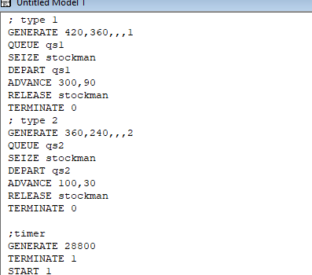
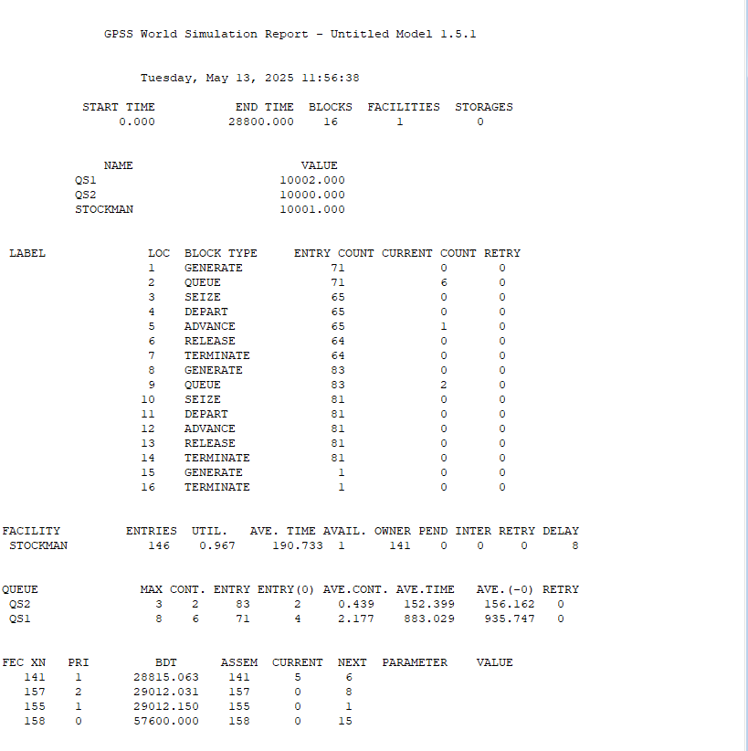
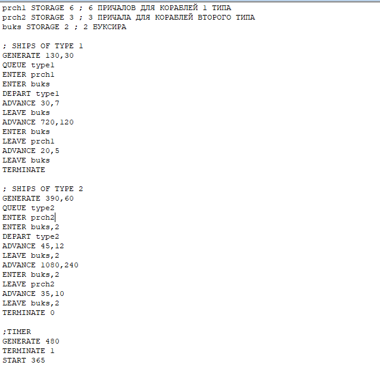
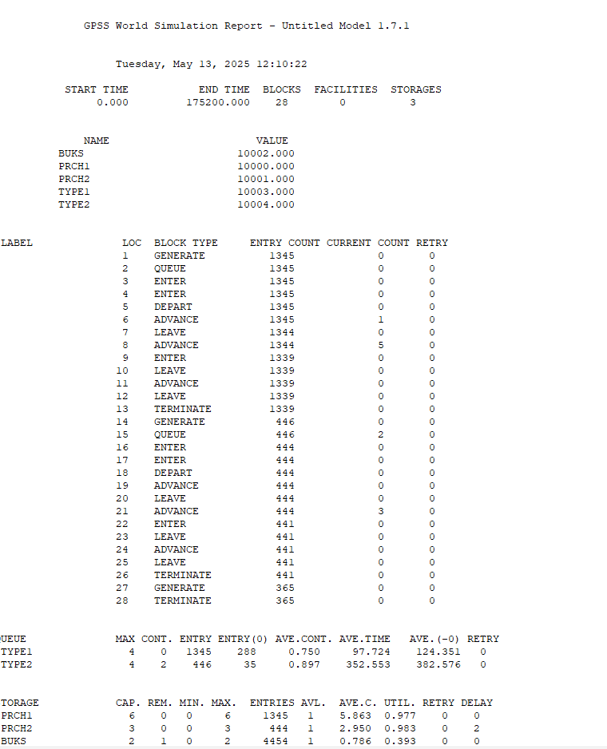
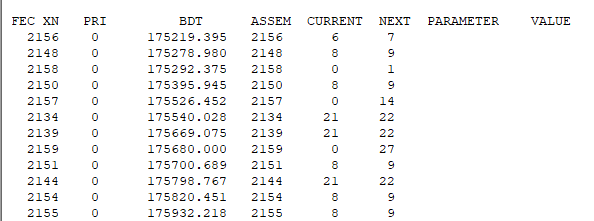

---
## Front matter
lang: ru-RU
title: Лабораторная работа №15
subtitle: Модели обслуживания с приоритетами
author:
  - Хватов М.Г.
institute:
  - Российский университет дружбы народов, Москва, Россия

## i18n babel
babel-lang: russian
babel-otherlangs: english

## Formatting pdf
toc: false
toc-title: Содержание
slide_level: 2
aspectratio: 169
section-titles: true
theme: metropolis
header-includes:
 - \metroset{progressbar=frametitle,sectionpage=progressbar,numbering=fraction}
 - '\makeatletter'
 - '\beamer@ignorenonframefalse'
 - '\makeatother'
---

# Информация

## Докладчик

:::::::::::::: {.columns align=center}
::: {.column width="60%"}

  * Хватов Максим Григорьевич
  * студент
  * Российский университет дружбы народов
  * [1032204364@pfur.ru](mailto:1032204364@pfur.ru)

:::
::: {.column width="25%"}

:::
::::::::::::::

## Цель работы

Реализовать модели обслуживания с приоритетами и провести анализ результатов.

## Задание

Реализовать с помощью gpss:

- Модель обслуживания механиков на складе
- Модель обслуживания в порту судов двух типов

# Выполнение лабораторной работы

{#fig:001 width=70%}

## Модель оформления заказов клиентов одним оператором

{#fig:002 width=70%}

## Выполнение лабораторной работы

{#fig:003 width=70%}

## Выполнение лабораторной работы

{#fig:004 width=70%}

## Выполнение лабораторной работы

{#fig:005 width=70%}

## Выводы

В результате выполнения работы были реализованы с помощью gpss:

- Модель обслуживания механиков на складе;
- Модель обслуживания в порту судов двух типов

