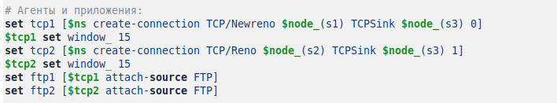
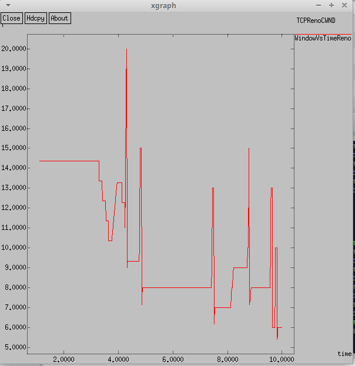
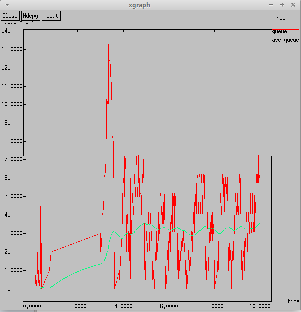
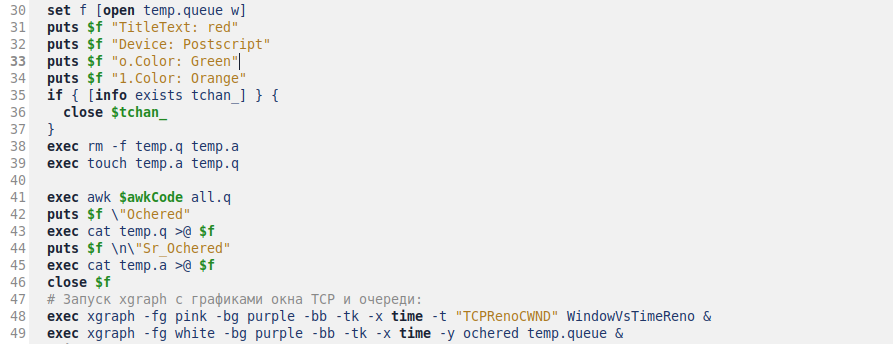
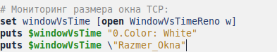
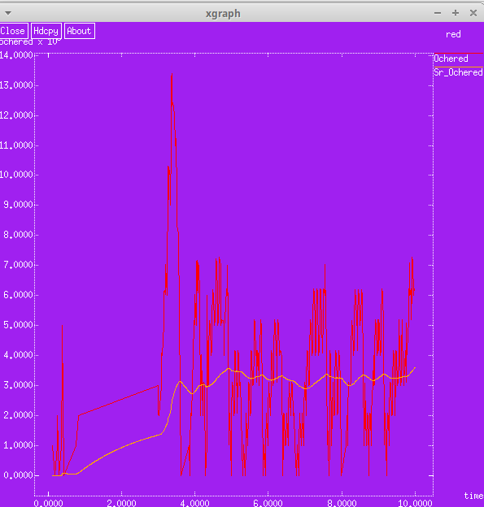

---
## Front matter
title: "Лабораторная работа 2"
subtitle: "Исследование протокола TCP и алгоритма управления очередью RED"
author: "Хватов Максим Григорьевич"

## Generic otions
lang: ru-RU
toc-title: "Содержание"

## Bibliography
bibliography: bib/cite.bib
csl: pandoc/csl/gost-r-7-0-5-2008-numeric.csl

## Pdf output format
toc: true # Table of contents
toc-depth: 2
lof: true # List of figures
lot: false # List of tables
fontsize: 12pt
linestretch: 1.5
papersize: a4
documentclass: scrreprt
## I18n polyglossia
polyglossia-lang:
  name: russian
  options:
	- spelling=modern
	- babelshorthands=true
polyglossia-otherlangs:
  name: english
## I18n babel
babel-lang: russian
babel-otherlangs: english
## Fonts
mainfont: PT Serif
romanfont: PT Serif
sansfont: PT Sans
monofont: PT Mono
mainfontoptions: Ligatures=TeX
romanfontoptions: Ligatures=TeX
sansfontoptions: Ligatures=TeX,Scale=MatchLowercase
monofontoptions: Scale=MatchLowercase,Scale=0.9
## Biblatex
biblatex: true
biblio-style: "gost-numeric"
biblatexoptions:
  - parentracker=true
  - backend=biber
  - hyperref=auto
  - language=auto
  - autolang=other*
  - citestyle=gost-numeric
## Pandoc-crossref LaTeX customization
figureTitle: "Рис."
tableTitle: "Таблица"
listingTitle: "Листинг"
lofTitle: "Список иллюстраций"
lotTitle: "Список таблиц"
lolTitle: "Листинги"
## Misc options
indent: true
header-includes:
  - \usepackage{indentfirst}
  - \usepackage{float} # keep figures where there are in the text
  - \floatplacement{figure}{H} # keep figures where there are in the text
---

# Цель работы

Исследовать протокол TCP и алгоритм управления очередью RED.

# Задание

1. Выполнить пример с дисциплиной RED;
2. Изменить в модели на узле s1 тип протокола TCP с Reno на NewReno, затем на
Vegas. Сравнить и пояснить результаты;
3. Внести изменения при отображении окон с графиками (изменить цвет фона,
цвет траекторий, подписи к осям, подпись траектории в легенде).

# Выполнение лабораторной работы

Выполним построение сети в соответствии с описанием:

- сеть состоит из 6 узлов;
- между всеми узлами установлено дуплексное соединение с различными пропускной способностью и задержкой 10 мс;
- узел r1 использует очередь с дисциплиной RED для накопления пакетов, максимальный размер которой составляет 25;
- TCP-источники на узлах s1 и s2 подключаются к TCP-приёмнику на узле s3;
- генераторы трафика FTP прикреплены к TCP-агентам.

Теперь разработаем сценарий, реализующий модель согласно описанию, чтобы построить в Xgraph график изменения TCP-окна, график изменения длины очереди и средней длины очереди.

```
# создание объекта Simulator
set ns [new Simulator]

# открытие на запись файла out.nam для визуализатора nam
set nf [open out.nam w]

# все результаты моделирования будут записаны в переменную nf
$ns namtrace-all $nf

# открытие на запись файла трассировки out.tr
# для регистрации всех событий
set f [open out.tr w]
# все регистрируемые события будут записаны в переменную f
$ns trace-all $f

# Процедура finish:
proc finish {} {
  global tchan_
  # подключение кода AWK:
  set awkCode {
    {
      if ($1 == "Q" && NF>2) {
        print $2, $3 >> "temp.q";
        set end $2
      }
      else if ($1 == "a" && NF>2)
        print $2, $3 >> "temp.a";
    }
  }
  set f [open temp.queue w]
  puts $f "TitleText: red"
  puts $f "Device: Postscript"
  if { [info exists tchan_] } {
    close $tchan_ 
  }
  exec rm -f temp.q temp.a
  exec touch temp.a temp.q
  exec awk $awkCode all.q
  puts $f \"queue
  exec cat temp.q >@ $f
  puts $f \n\"ave_queue
  exec cat temp.a >@ $f
  close $f
  # Запуск xgraph с графиками окна TCP и очереди:
  exec xgraph -bb -tk -x time -t "TCPRenoCWND" WindowVsTimeReno &
  exec xgraph -bb -tk -x time -y queue temp.queue &
  exit 0
}

# Формирование файла с данными о размере окна TCP:
proc plotWindow {tcpSource file} {
  global ns
  set time 0.01
  set now [$ns now]
  set cwnd [$tcpSource set cwnd_]
  puts $file "$now $cwnd"
  $ns at [expr $now+$time] "plotWindow $tcpSource $file"
}

# Узлы сети:
set N 5
for {set i 1} {$i < $N} {incr i} {
  set node_(s$i) [$ns node]
}
set node_(r1) [$ns node]
set node_(r2) [$ns node]
# Соединения:
$ns duplex-link $node_(s1) $node_(r1) 10Mb 2ms DropTail
$ns duplex-link $node_(s2) $node_(r1) 10Mb 3ms DropTail
$ns duplex-link $node_(r1) $node_(r2) 1.5Mb 20ms RED
$ns queue-limit $node_(r1) $node_(r2) 25
$ns queue-limit $node_(r2) $node_(r1) 25
$ns duplex-link $node_(s3) $node_(r2) 10Mb 4ms DropTail
$ns duplex-link $node_(s4) $node_(r2) 10Mb 5ms DropTail

# Агенты и приложения:
set tcp1 [$ns create-connection TCP/Reno $node_(s1) TCPSink $node_(s3) 0]
$tcp1 set window_ 15
set tcp2 [$ns create-connection TCP/Reno $node_(s2) TCPSink $node_(s3) 1]
$tcp2 set window_ 15
set ftp1 [$tcp1 attach-source FTP]
set ftp2 [$tcp2 attach-source FTP]

# Мониторинг размера окна TCP:
set windowVsTime [open WindowVsTimeReno w]
set qmon [$ns monitor-queue $node_(r1) $node_(r2) [open qm.out w] 0.1];
[$ns link $node_(r1) $node_(r2)] queue-sample-timeout;
# Мониторинг очереди:
set redq [[$ns link $node_(r1) $node_(r2)] queue]
set tchan_ [open all.q w]
$redq trace curq_
$redq trace ave_
$redq attach $tchan_


# Добавление at-событий:
$ns at 0.0 "$ftp1 start"
$ns at 1.1 "plotWindow $tcp1 $windowVsTime"
$ns at 3.0 "$ftp2 start"
$ns at 10 "finish"

# запуск модели
$ns run
```

В результате у нас поучается  график (рис. [-@fig:001]) и несколько файлов в каталоге
График показывает изменение TCp-окна, а также графк, который показывает изменение очоереди и средней длины очереди (рис. [-@fig:002])

{#fig:001 width=70%}

{#fig:002 width=70%}

{#fig:003 width=70%}

по графикам видно, что средняя длина очереди находится в диапозоне от 3 до 4, а максимальная длина около 14

## Упражнение

Изменил код в файле lab2.tcl (рис. [-@fig:004])

{#fig:004 width=70%}

Результат выполнения этого кода:

{#fig:005 width=70%}

В результате получим следующие график изменения TCP-окна (рис. [-@fig:007]), а также график изменения длины очереди
и средней длины очереди (рис. [-@fig:006]).


{#fig:007 width=70%}

{#fig:006 width=70%}

По графику видно, что средняя длина очереди опять находится в диапазоне от 2 до 4 (но можно заметить, что значение длины чаще бывает меньшим, чем при типе Reno/NeReno). Максимальная длина достигает значения 14. Сильные отличия можно заметить по графикам динамики размера окна. При Vegas максимальный размер окна составляет 20, а не 34, как в NewReno. TCP Vegas обнаруживает перегрузку в сети до того, как случайно теряется пакет, и мгновенно уменьшается размер окна.Таким образом, TCP Vegas обрабатывает перегрузку без каких-либо потерь пакета.

## Изменение отображения окон с графиками

Внес изменения в цвет траекторий, подписи легенд, а также добавил опции -fg -bg изменил цвет текста и фона xgraph

{#fig:008 width=70%}

Внес изменения в подпись графика, добавив размер окна

{#fig:009 width=70%}

В результате получились графики:

{#fig:010 width=70%}

# Вывод

В процессе выполнения лабораторной работы я исследовал протокол TCP и алгоритм управления очередью RED.
